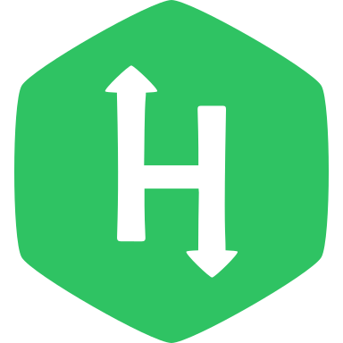

<!-- 
-->

    

<h1 align="center">
  HackerRank
</h1>

  This repo contains solutions to those problems which I've solved in HackerRank

  

<h1 align="left">
  <b>&nbsp;Languages</b>
</h1>

Most of the solutions available in this repo are coded in C. Few solutions are coded in Java & C++

<h1 align="left">
  <b>&nbsp;Contents</b>
</h1>

 - C
   - [Easy] (C/Easy)
   - [Hard] (C/Hard)
 - Java
   - [Easy] (Java/Easy)
   
<h1 align="left">
  <b>&nbsp;Credits</b>
</h1>

 - Icons by <a target="_blank" href="https://icons8.com/icon/h5EUmNCXhSH0/hackerrank-is-a-technology-company-that-focuses-on-competitive-programming">Icons8</a>

---
